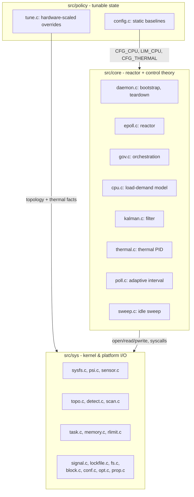
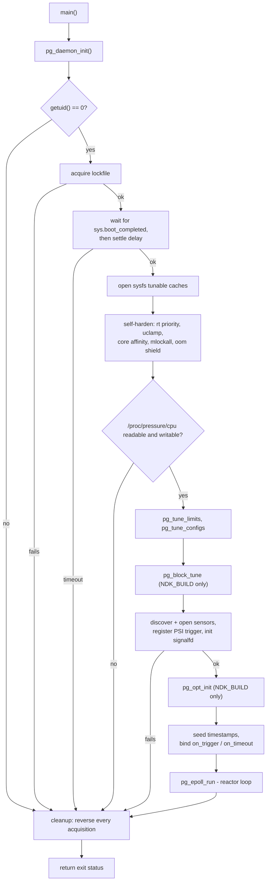
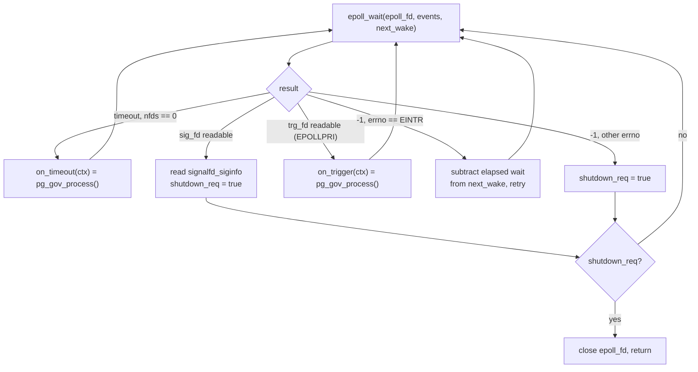
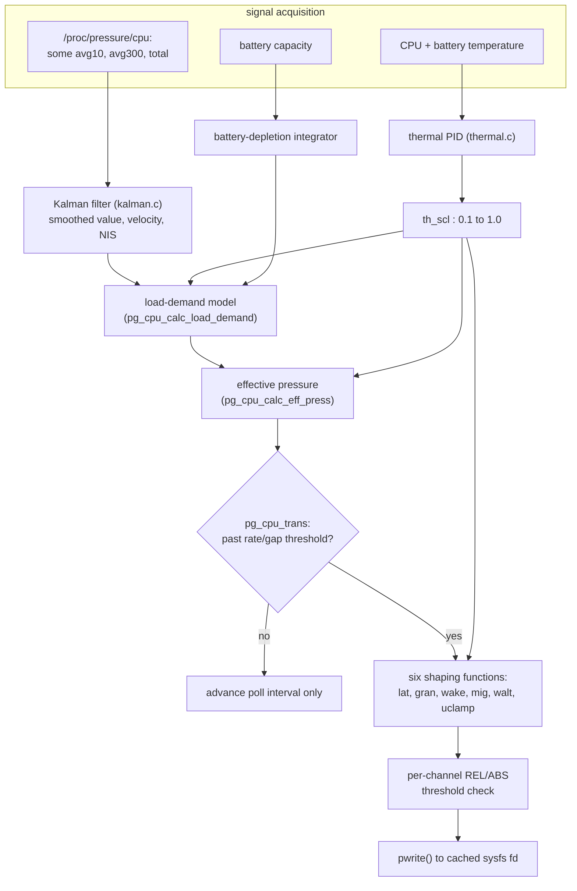
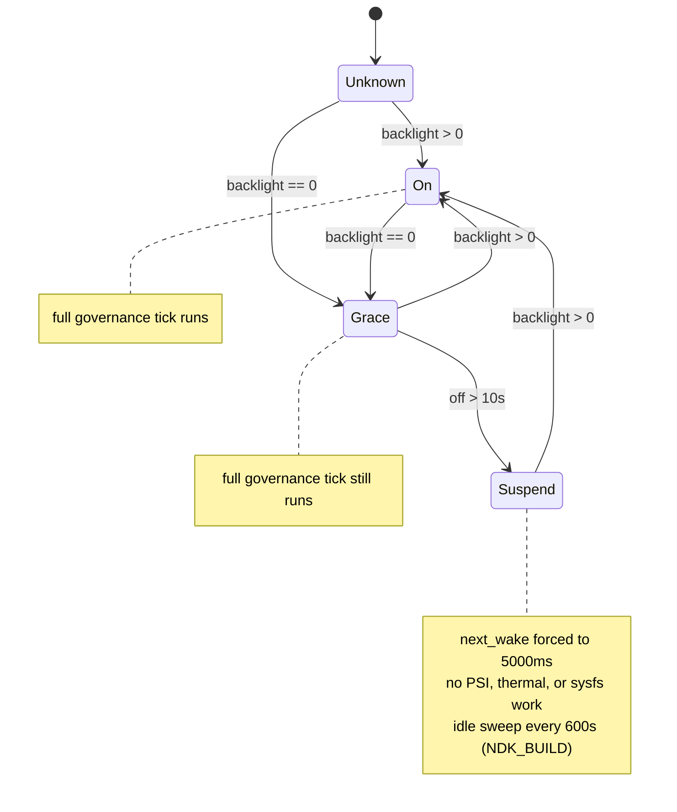

# Architecture

 `pgov` is a userspace daemon for Android (`pgovd`) that keeps a handful of
Linux scheduler tunables - CFS latency and granularity, migration cost, the
WALT init-task load estimate, and `uclamp_util_min` - in step with how much
pressure the CPU is actually under. It doesn't invent its own load metric.
It reads the kernel's own PSI accounting from `/proc/pressure/cpu`, runs
that through a small adaptive filter, and turns the result into six sysfs
writes, gated by thermal and battery state.

A few constraints shaped everything else in this codebase, so it's worth
stating them up front instead of letting them show up as surprises later:

- **Single thread, no heap.** There's no `pthread` anywhere, no
  `malloc`/`free`, nothing. Every buffer is either a stack array or a field
  of one static context struct. This isn't a performance flex - it's the
  easiest way to guarantee the daemon has no allocation failure paths and
  no lock contention to reason about.
- **No runtime floating point.** Every signal in the control loop is a
  Q16.16 fixed-point integer. `float`/`double` only show up inside a
  handful of compile-time conversion macros.
- **Invisible by default.** This process runs as root with `SCHED_FIFO`
  real-time priority, which is exactly the kind of thing that shows up in
  a battery-usage complaint if you're not careful. So it pins itself to
  the least capable CPU cluster, caps its own `uclamp_max`, relaxes its
  own timer slack, and generally goes out of its way to not look like a
  hog even though it technically outranks almost everything else on the
  system.

This document walks through the source the way I'd explain it to someone
reading it for the first time: how the tree is laid out, how the process
boots and shuts down, and - the part that matters most - how one PSI
sample turns into six sysfs writes on a given tick.

## Contents

1. [Source layout](#source-layout)
2. [Header conventions](#header-conventions)
3. [Build targets](#build-targets)
4. [Why fixed-point](#why-fixed-point)
5. [Runtime state](#runtime-state)
6. [Boot sequence](#boot-sequence)
7. [Hardening the process](#hardening-the-process)
8. [The reactor](#the-reactor)
9. [Finding the hardware](#finding-the-hardware)
10. [Reading PSI and filtering it](#reading-psi-and-filtering-it)
11. [Keeping thermals in check](#keeping-thermals-in-check)
12. [From pressure to scheduler knobs](#from-pressure-to-scheduler-knobs)
13. [Writing sysfs without spamming it](#writing-sysfs-without-spamming-it)
14. [Picking the next poll interval](#picking-the-next-poll-interval)
15. [Display state and idle housekeeping](#display-state-and-idle-housekeeping)
16. [Calibrating for the device it's running on](#calibrating-for-the-device-its-running-on)
17. [The optional config file](#the-optional-config-file)
18. [Shutting down](#shutting-down)
19. [Closing notes](#closing-notes)

## Source layout

```
include/
├── block.h         conf.h        detect.h       fs.h
├── compiler.h      daemon.h      epoll.h        lockfile.h
├── memory.h        opt.h         parser.h       paths.h
├── prop.h          psi.h         rlimit.h       scan.h
├── sensor.h        str.h         sysfs.h        task.h
├── topo.h
└── pg/
    ├── config.h    cpu.h         gov.h          kalman.h
    ├── log.h       math.h        poll.h         signal.h
    ├── state.h     sweep.h       thermal.h      time.h
    └── tune.h

src/
├── main.c
├── core/
│   ├── cpu.c       daemon.c      epoll.c        gov.c
│   └── kalman.c    poll.c        sweep.c        thermal.c
├── policy/
│   └── config.c    tune.c
└── sys/
    ├── block.c     conf.c        detect.c       fs.c
    ├── lockfile.c  memory.c      opt.c          prop.c
    ├── psi.c       rlimit.c      scan.c         sensor.c
    ├── signal.c    sysfs.c       task.c         topo.c
```

I keep three layers separated on purpose:

- **`src/sys/`** is nothing but mechanical wrappers - `open`/`read`/`pwrite`
  on sysfs and `/proc`, `sched_setaffinity`, `sched_setattr`, `ioprio_set`,
  `mlockall`, `flock`, `signalfd`, a raw `getdents64` walker, Android
  property access. Nothing in this directory makes a control decision. It
  does I/O and hands back a parsed value or an error code.
- **`src/core/`** is the reactor and every piece of control theory: the
  Kalman filter, the thermal PID loop, the load-demand tracker, adaptive
  polling, and the daemon's own boot/shutdown orchestration.
- **`src/policy/`** is just numbers - the static baseline tables and the
  routine that rewrites them once at startup for whatever hardware it
  finds itself on. No I/O of its own beyond what it delegates to `sys/`.



Nothing in `core/` or `policy/` touches a raw file descriptor or issues a
syscall directly - that always goes through `sys/`. That's the rule I try
not to break: control logic stays testable and readable, I/O stays boring
and centralized.

## Header conventions

Headers directly under `include/` guard themselves with `PGOV_<NAME>_H`.
Headers under `include/pg/` guard themselves with `PG_<NAME>_H`. Every
function everywhere still gets the same `pg_` symbol prefix, so the guard
prefix is really the only textual marker for "platform primitive" versus
"governor domain" header - but I've kept it consistent across every file.

The split itself exists because a handful of these names collide with
the C library's own headers - `time.h`, `signal.h`, and `math.h` are all
standard library names - and `log.h`/`config.h` are common enough
elsewhere in an Android/vendor build (`android/log.h`, autoconf-style
generated configs) to risk the same thing. Keeping them under `pg/` means
every internal include for one of these is written `pg/time.h` or
`pg/config.h` - unambiguous - instead of a bare `time.h` that could
resolve to the wrong file depending on the include path. Once that
directory existed for the names that actually needed it, it made more
sense to keep every governor-domain header together under it than to
split hairs over which ones strictly did.

Three headers don't line up cleanly with where they're implemented:
`daemon.h` and `epoll.h` sit in the flat `include/` tree even though
they're pure `src/core/` reactor logic, and `pg/signal.h` sits in the
domain tree even though `signal.c` is a thin OS wrapper with no control
logic in it - collision avoidance put it there, not the domain grouping.
I never went back and moved `daemon.h`
or `epoll.h` to match - it doesn't affect anything functionally, and
renaming headers this deep into the project has never felt worth the
diff.

A handful of headers are inline-only, with no matching `.c` file:
`compiler.h`, `str.h`, `parser.h`, `paths.h`, and, in `pg/`, `math.h`,
`time.h`, `log.h`, and `state.h`.

## Build targets

I build this two different ways, both C11 with `-Wall -Wextra -Werror`:

- **CMake / NDK** (`CMakeLists.txt`, `CMakePresets.json`) is the primary
  target - a `Ninja` build against `android-30`, `arm64-v8a` and
  `armeabi-v7a`, `Debug`/`Release` presets. It globs everything under
  `src/**/*.c` except `main.c` into a static library `pgov`, then links a
  separate `pgovd` executable against it plus `android`, `log`, and `m`.
  `target_compile_definitions(pgov PUBLIC NDK_BUILD)` is the single switch
  that turns on every `NDK_BUILD`-gated path in this document. Release
  adds `-O2 -ffunction-sections -fdata-sections -fvisibility=hidden
-fno-math-errno -fno-signed-zeros -fno-trapping-math`, LTO where
  available, and a stripped, section-GC'd, build-id-less link
  (`-Wl,--gc-sections -Wl,--icf=all -Wl,-s -Wl,--build-id=none -Wl,-O2
-Wl,--as-needed`). `tools/termux.sh` drives this same build straight on
  a device instead of cross-compiling from a host - it installs
  `clang`/`cmake`/`ninja` through `pkg` if they're missing, maps
  `uname -m` to the right ABI, and never touches the NDK toolchain file at
  all. This is how I ship `pgov` as a Magisk module: `tools/mkmod.py`
  stages both release binaries into the module skeleton under `modules/`
  and zips the result to `dist/pgovd-<version>.zip`, reading the version
  straight out of `modules/module.prop`.
- **Soong / AOSP** (`android/Android.bp`) is for anyone who wants to build
  this straight into a vendor tree instead: a `vendor: true`,
  thin-LTO `cc_library_static` (`libpgov`) plus `cc_binary` (`pgovd`,
  starting from `pgovd.rc`, linking `liblog`). This path never defines
  `NDK_BUILD`, and its `exclude_srcs` drops `main.c`, `sweep.c`, `conf.c`,
  `fs.c`, `opt.c`, and `block.c` - `pgovd`'s own `cc_binary` rule supplies
  `main.c` separately, and `block.c` is guarded by the same
  `#if defined(NDK_BUILD)` as the other four, so excluding it keeps the
  Soong build from carrying a translation unit that would otherwise
  compile down to nothing.
- `tools/prepaosp.py` repackages the tree for that second path: it moves
  the four AOSP build files out of `android/` and deletes everything
  NDK/CMake/Magisk-specific, leaving a clean `include/` + `src/` +
  four-build-files tree suitable for dropping into a vendor source tree.
  It has no effect on runtime behavior - it's a packaging convenience.

`NDK_BUILD` is the only macro distinguishing the two targets. This is
everywhere it matters:

| Location                     | Without `NDK_BUILD`                                                                  |
| ---------------------------- | ------------------------------------------------------------------------------------ |
| `pg/sweep.h`, `core/sweep.c` | idle cache sweep doesn't exist                                                       |
| `conf.h`, `sys/conf.c`       | config-file parser doesn't exist                                                     |
| `opt.h`, `sys/opt.c`         | config-driven sysfs/property overrides don't exist                                   |
| `block.h`, `sys/block.c`     | excluded from the Soong build via `exclude_srcs`, same as `sweep.c`/`conf.c`/`opt.c` |
| `prop.h`, `sys/prop.c`       | `pg_prop_wait_boot()` stays; the capture/restore property helpers don't exist        |
| `paths.h`                    | `PG_PATH_LOCK` becomes `/data/vendor/pgovd/pgovd.lock`; `CONF_PATH` isn't defined    |
| `pg/state.h`                 | `struct pg_context` loses its `last_sweep` field                                     |
| `core/daemon.c`              | drops `pg_block_tune()`, `pg_opt_init()`/`pg_opt_exit()`, the `last_sweep` seed      |
| `core/gov.c`                 | drops the sweep-invocation branch in `update_disp()`                                 |

## Why fixed-point

Everything in the control loop is `q16_t` (`int32_t`, Q16.16) or, where a
product would overflow 32 bits, `q32_t` (`int64_t`, Q32.32) - both in
`include/pg/math.h`. `Q16_TO_Q32`/`Q32_TO_Q16` bracket every `q32_mul`
call that needs the wider intermediate. `FLOAT_TO_Q16`/`INT_TO_Q16` only
ever get handed compile-time literals (`FLOAT_TO_Q16(0.34F)` and the
like) - I don't touch a runtime `float` or `double` anywhere outside
`math.h`'s own macro bodies.

`math.h` carries the primitives everything else builds on: saturating
`q16_mul`/`q16_div` (dividing by zero returns `INT32_MAX`/`INT32_MIN`
instead of trapping), a 64-bit integer square root and its Q16 wrapper,
`pg_math_clamp`, `pg_math_lerp`, a logistic `pg_math_sigmoid(val, k,
mid)`, an exponential-decay approximation `pg_math_decay`, an algebraic
sigmoid `pg_math_alg_sig(x) = x / sqrt(1+x^2)` (saturates past ±180 in
real units), and two "sanitize" helpers that turn a signed Q16 value into
an unsigned integer ready to write to sysfs: `pg_math_san_u64`
(round-to-nearest) and `pg_math_san_quant_u64` (the same, plus a
millisecond-to-nanosecond scale and rounding to a caller-supplied step).
`q32_mul` picks between a 128-bit-multiply fast path and a manual
four-way 32-bit partial-product fallback depending on whether
`__SIZEOF_INT128__` is defined - I wanted this to keep working on targets
without `__int128`, not just the ones I personally test against.

`parser.h` builds on the same type for branch-light text parsing
(`pg_parse_i32`, `pg_parse_u64`, `pg_parse_q16`) and integer formatting
(`pg_fmt_u32`, `pg_fmt_u64`), so reading and writing sysfs nodes never
touches `sscanf`/`snprintf`.

## Runtime state

I keep exactly four mutable globals, on purpose - I'd rather have all of
them visible in one place than scattered:

- `static struct pg_context context;` in `daemon.c` - the entire runtime
  state.
- `LIM_CPU`, `CFG_CPU`, `CFG_THERMAL` in `policy/config.c` - statically
  initialized, then rewritten once by `pg_tune_limits()`/
  `pg_tune_configs()` during boot, and read-only after that. Nothing else
  in the tree writes to their fields.
- `static struct pg_prop_state props[MAX_PROPS]` (64 entries) in
  `sys/opt.c`, `NDK_BUILD` only - bookkeeping for the optional config
  file's property overrides.

`struct pg_context` (`pg/state.h`), `ALIGNED(64)`, is where everything
else lives: the PSI monitor, four sensor handles (CPU temp, battery temp,
battery capacity, backlight - each with its own fd and a small read
buffer), six `pg_sysfs_cache` entries, thermal-loop state, load-demand
state, poll state, the display-state enum, cached battery level/temp,
timestamps, four file descriptors, `next_wake` - a bare `int` alongside
them holding the poll timeout in milliseconds, not itself a descriptor -
a `volatile bool shutdown_req`, and two function pointers - `on_trigger`
and `on_timeout` - that I bind to the same function at startup. Because
this is one static instance passed around by pointer, there's no
per-tick allocation and no per-connection state to track; the whole
daemon's memory footprint is fixed at compile time.

## Boot sequence

`main()` does about as little as it can - discard `argv`, stamp
`.note.pgov.author`/`.note.pgov.license` ELF sections via
`PGOV_AUTHOR`/`PGOV_LICENSE` (so a stripped release binary still carries
provenance you can pull with `readelf`), and return whatever
`pg_daemon_init()` returns. There's no argument parsing in this codebase
at all - runtime configuration goes through the optional config file
instead (see below), never flags.



Every failure path converges on the same cleanup block, and that's
deliberate: `init_context_defaults()` sets every descriptor to `-1` before
anything is acquired, and every close/cleanup helper in `sys/` checks its
own handle before acting, so the same teardown sequence is safe to run
whether ten resources got initialized or two. I didn't want a second,
special-cased "partial init" cleanup path to maintain alongside the normal
one.

A couple of the steps are worth calling out by their actual numbers,
since they're easy to get wrong reading the code cold: boot-completion
polling waits up to `PG_BOOT_RETRY_MAX` (300) tries at
`PG_BOOT_POLL_SEC` (1s) intervals for `sys.boot_completed`, then sleeps an
additional `PG_STAB_DELAY_SEC` (10s) before moving on. `/proc/pressure/cpu`
has to be both readable and writable or I bail out with `-ENODEV` - there's
no fallback signal source if the running kernel doesn't have `CONFIG_PSI`.

## Hardening the process

`init_os_environment()` applies one policy consistently: this process must
never be starved, killed, or paged out, but it also must never look like
it's competing with foreground work. Five independent mechanisms get there,
all in `src/sys/`:

- **Crash visibility** (`signal.c`) - a `SA_SIGINFO` handler on `SIGSEGV`,
  `SIGFPE`, `SIGABRT`, `SIGILL` that logs to `stderr`, restores the
  default disposition, and re-raises, so a crash is visible without
  changing the resulting core-dump/exit-status behavior.
- **OOM immunity** (`memory.c`) - `/proc/self/oom_score_adj` gets `-1000`,
  the most negative value the kernel accepts, so neither the OOM killer
  nor Android's LMK will touch this process.
- **Page locking** (`memory.c`) - `mlockall`, preferring
  `MCL_CURRENT | MCL_FUTURE | MCL_ONFAULT` (lock lazily, on first fault) and
  falling back to eager `MCL_CURRENT | MCL_FUTURE` if `ONFAULT` isn't
  supported. Failure here is logged, not fatal - I'd rather run unlocked
  than not run.
- **Resource limits** (`rlimit.c`) - `RLIMIT_NOFILE` goes up to its hard
  ceiling; `RLIMIT_STACK` gets clamped down to `PG_STACK_SIZE` (512 KiB).
- **Scheduling class** (`task.c`) - affinity gets pinned to the least
  capable CPU cluster (`pg_topo_set_little_core()`), policy switches to
  `SCHED_FIFO` at `PG_RT_PRIORITY` (50), timer slack relaxes to
  `PG_TIMER_SLACK_NS` (50ms) so the kernel can batch this process's
  wakeups with others, and a raw `sched_setattr` call applies
  `PG_UCLAMP_MAX` (102 of 1024) as a uclamp-max ceiling - capping the
  utilization the scheduler will ever attribute to this task - gated
  behind `SCHED_FLAG_UTIL_CLAMP_MAX` together with
  `SCHED_FLAG_KEEP_POLICY | SCHED_FLAG_KEEP_PARAMS`, which is what keeps
  the call from touching the `SCHED_FIFO` policy and priority set moments
  earlier. I/O priority goes to best-effort
  class 2, priority 0, via a raw `ioprio_set`. Both `ioprio_set` and
  `sched_setattr` syscall numbers get architecture-specific fallback
  `#define`s (`aarch64`/`arm`/other) behind `#ifndef`, since Bionic
  doesn't always declare them.

Running real-time and utilization-clamped at the same time looks like a
contradiction until you think about what each one is actually for: RT
priority means I'm never preempted when I need to act; the uclamp ceiling
means I never get counted as if I need much. I lift that ceiling exactly
once, temporarily, for the idle sweep - see below.

## The reactor

`pg_epoll_run()` sets up one `epoll` instance with two descriptors: the
`signalfd` from `pg_signal_init()` (`EPOLLIN | EPOLLERR`) and the PSI
trigger descriptor (`EPOLLPRI | EPOLLERR | EPOLLET` - edge-triggered,
matching the kernel PSI monitor's `POLLPRI` semantics). Then it loops on
`epoll_wait(..., next_wake)` until `shutdown_req` flips.



`on_trigger` and `on_timeout` are bound to the same function,
`pg_gov_process()` - whether the reactor woke because the adaptive timer
elapsed or because the kernel reported a pressure threshold breach, the
same governance tick runs either way. I keep `pg_epoll_add_trg`/
`pg_epoll_rm_trg` as separate entry points so `gov.c` can re-register the
trigger descriptor after a PSI read failure without tearing down the whole
reactor for it.

## Finding the hardware

Thermal-zone and backlight sysfs layouts aren't consistent across Android
vendors, so I don't hardcode paths - `sys/scan.c` discovers them:

- `pg_scan_thermal_zone()` walks `/sys/class/thermal/thermal_zone*`,
  reads each zone's `type`, and matches in two passes: first against a
  fixed priority list of known vendor CPU-zone names (`cpu`,
  `cpu0_thermal`, `mtktscpu`, `exynos_thermal`, `tsens_tz_sensor0`,
  `big-core`, and roughly two dozen others across MediaTek, Qualcomm,
  Samsung, and HiSilicon naming), then, failing that, a heuristic pass
  that accepts anything containing `cpu`, `soc`, `cluster`, or `ap` and
  not on a denylist of unrelated zones (`battery`, `gpu`, `camera`,
  `wifi`, `pmic`, `backlight`, others).
- `pg_scan_backlight()` walks `/sys/class/backlight/*` and takes the first
  entry whose `brightness` file opens.
- `pg_scan_trip_point()` walks the zones again with the same heuristic
  filter, but never consults the priority list, and probes
  `trip_point_{0..9}_type` for anything containing `passive` or
  `critical`, returning the matching `_temp` sibling path on the first
  zone that has one. This makes it independent from the CPU-zone
  temperature scan above - on a device where the priority list matches a
  different zone than the heuristic pass would reach first, the two can
  end up pointed at different thermal zones.

`pg_scan_thermal_zone()` caps its zone table at 256 entries; all three
functions otherwise rely on fixed-size stack buffers and the string
helpers in `str.h` rather than libc formatting functions - same
no-heap-allocation rule as everywhere else.

`sys/sensor.c` wraps four sensor kinds behind an open-once,
`pread`-repeatedly pattern: CPU temperature (scaled ÷1000, millidegrees),
battery temperature (scaled ÷10, decidegrees - matching
`/sys/class/power_supply/battery/temp`'s usual convention), battery
capacity (raw percentage), backlight brightness (raw integer). Every read
has a typed fallback - 65°C, 35°C, 100%, 0 - on open, I/O, or parse
failure, so a missing or misbehaving node degrades the signal instead of
propagating an error into the control loop. `pg_sensor_get_trip_temp()`
adds a sanity band on top of the discovered trip point: anything outside
40–115°C gets discarded in favor of the fallback.

`sys/topo.c` reads
`/sys/devices/system/cpu/cpu%d/{cpufreq/cpuinfo_max_freq,cpu_capacity}`
for core count, max frequency, and per-cluster capacity.
`pg_topo_set_little_core()` builds a `cpu_set_t` from whichever cluster reports the
lowest `cpu_capacity` (falling back to lowest `cpuinfo_max_freq` if
capacity data isn't there, and to binding every core with a logged warning
if neither is) and applies it with `sched_setaffinity(0, ...)` - this is
what actually confines the daemon to the SoC's efficiency cluster.

`sys/detect.c` covers three boot-time checks: PSI access, root privilege,
and kernel HZ (`sysconf(_SC_CLK_TCK)`, falling back to 100) - the last one
feeds directly into the calibration pass later.

## Reading PSI and filtering it

`/proc/pressure/cpu` gives lines like `some avg10=<v> avg300=<v>
avg60=<v> total=<v>` (plus a `full` line I don't read). `pg_psi_read()`
finds the `some` line in one buffered `pread` and hand-parses it:
`avg10` only on the very first read (it exists purely to seed the filter);
`avg300` on every read, kept around as a slow load baseline; `total` - a
monotonically increasing microsecond counter - on every read, and it's
the basis for a rate I compute myself rather than trust the kernel's
decayed average for:

```
delta = total_now - total_prev
rate  = delta * 100 / dt_us     (percent, Q16)
```

If the counter hasn't advanced since the last read, that tick's
measurement is 0 rather than skipped or carried forward - the filter
below still runs, just against a reading that says no stall accumulated.
I do it this way because `avg10` uses a fixed decay time constant that can
lag behind however fast I'm actually polling - deriving the rate directly
from the cumulative counter gives me something fresher to filter.

That `rate` (or, on the first read, the parsed `avg10`) is the measurement
fed into a two-state Kalman filter shared by the PSI monitor and, with
different tuning, the thermal loop below. It models the signal as
constant-velocity - position (the smoothed PSI estimate) and velocity -
with a 2×2 state covariance propagated through a discretized process-noise
matrix built from `dt`, `dt²`, `dt³`, `dt⁴` terms. I don't hold the noise
parameters fixed: every update, a clamped innovation gets squared and
folded into a 5%/95% EMA of observed innovation covariance. Subtracting
the filter's own predicted _position_ covariance off that EMA gives the
measurement noise directly (clamped [0.1, 50]); comparing that same EMA
against the _full_ predicted innovation covariance - position covariance
plus the measurement noise just derived - is what decides the process
noise: above it, `q_vel` gets nudged up by 5% of the gap between them; at
or below it, `q_vel` just decays 5% toward zero (clamped [0.01, 20]
either way). NIS, which I use downstream as a structural-break detector,
comes from the raw innovation rather than the clamped one feeding the EMA
above - the clamp keeps one outlier from distorting the learned noise
floor, but NIS is supposed to notice that outlier, so it has to see the
unclamped value. If real elapsed time between reads exceeds 5 seconds (a
suspend gap, most likely), I reset the filter outright before updating
rather than integrating across the gap.

`pg_psi_open_trg()` registers the kernel-side monitor by writing `some
<threshold_us> <window_us>\n` to the same path opened `O_RDWR |
O_NONBLOCK` - `PG_PSI_THRESHOLD_US` (100000, 100ms of stall) over
`PG_PSI_WINDOW_US` (1000000, a 1s window). That descriptor is what the
reactor polls for `EPOLLPRI`. `pg_psi_recov()` closes, reopens, and resets
the filter when a read fails outright; `pg_psi_read_raw()` is a stateless
one-shot `avg10` reader used only by the idle sweep's interrupt check.

## Keeping thermals in check

`pg_thermal_update()` is a PID controller with adaptive gains and
anti-windup, run every tick regardless of what the display-state machine
is doing elsewhere. Its input is CPU temperature, run through its own
Kalman filter instance (seeded tighter than the PSI filter - `q_vel =
0.01`, `r_meas = 2.0` - since temperature moves slower and cleaner than
PSI does) to get a smoothed value and a velocity estimate.

The setpoint isn't fixed. It starts at `cfg->limit_cpu` and gets pulled
down by up to 5°C as battery temperature closes in on `cfg->limit_bat`,
so battery thermal headroom feeds directly into the CPU setpoint rather
than being handled as a separate concern. Proportional and integral gains
both scale inversely with distance to the setpoint - they sharpen as
temperature gets close, instead of staying flat across the whole range -
and the derivative gain gets an extra boost from positive velocity
(heating, not cooling, gets the extra attention). The integral term is
clamped to [-50, 50] and bleeds off under anti-windup whenever the raw,
unsaturated output diverges from the saturated [0, 100] output by more
than a small margin, at a rate that itself grows the longer the output has
stayed saturated.

The output gets inverted and normalized into a thermal scale factor,
`th_scl = 1 - u_sat/100` - 1.0 meaning no restriction, lower meaning
progressively more - clamped to [0.1, 1.0] on the normal path. If battery
temperature has hit its own limit outright, that clamp is bypassed
instead of tightened: I take whichever is lower, 0.2 or whatever the raw
CPU-temperature PID alone produced, so the 0.1 floor doesn't apply in
this branch and `th_scl` can in principle run lower than the normal path
ever allows; battery safety wins that argument every time. `th_scl` then
feeds into the load-demand model's gain term, the latency and uclamp
shaping, and the wakeup-granularity curve - it touches almost everything
downstream.

## From pressure to scheduler knobs

This is the part of the codebase I'd point to first if someone asked what
`pgov` actually does. Everything above exists to feed this pipeline; the
six writes at the end of it are the entire point of the daemon.



Battery level and temperature are cheaper than the rest of this pipeline:
both are re-read on their own five-second cadence (`PG_BAT_CHK_SEC`)
rather than every tick, and it's the cached values that everything below
actually consumes.

**Effectiveness parameters** get recomputed first, every tick, from
current battery level and `th_scl`: a `health` factor
(`battery_fraction * th_scl`) scales response gain, surge gain, and
trend-amplification; thermal scale alone scales lookahead and decay; and
the sigmoid midpoints used later for latency and uclamp shaping shift
upward with the 300-second PSI baseline, so a system that's been under
sustained load recently needs more instantaneous pressure before the same
curves respond.

**The battery-depletion integrator** takes a cubic function of how
depleted the battery is (`97 * ((100 - level)/100)^3`) and derives a rate
from its tick-to-tick change against a fixed 5-second time constant.
What reaches the load-demand model is that raw tracked value and a plain
finite difference of two consecutive raw samples divided by `tau`. This
integrator doesn't produce an output of its own.

**The load-demand model** is where I spent the most time getting the feel
right. It treats the running PSI estimate as a critically-damped
second-order system chasing a lookahead-extrapolated target
(`pred = tgt_psi + vel * lookahead`), with one pre-emptive kick applied
before any of that:

- If the raw PSI velocity's magnitude clears `surge_thresh`, the internal
  rate state gets an immediate additive nudge - `vel * surge_gain` -
  before `pred` is even computed. It's a fast-attack path layered on top
  of the spring/damper dynamics below, for the specific case where
  pressure is already moving quickly enough that waiting on the net-force
  integration to catch up would cost a tick or two it doesn't need to.
- A proportional ("spring") term, `k_fin * (pred - psi_val)`, where
  `k_fin` combines the response gain, a trend multiplier driven by
  positive-only velocity, and the _square_ of `th_scl` - thermal
  restriction suppresses responsiveness faster than linearly on purpose.
- A damping ("dashpot") term, `c_fin * rate`, where `c_fin` is the larger
  of two independently computed values: one from critical damping
  (`2*sqrt(k_fin) * stab_rat`), further modulated by how fast the
  integrator is moving relative to how fast pressure itself is moving;
  the other purely from thermal scale (`c_base / sqrt(th)`), so damping
  rises as thermal headroom shrinks.
- An integral term contributing `integ * psi_val`, capped at 1.5× a
  reference magnitude derived from `k_fin`.
- The net force is hard-clamped to ±32000 (Q16) before it's applied.
- Velocity integrates against `dt_safe` - `dt_real` clamped to a tiny
  epsilon floor and a 100ms ceiling - while position integrates against
  the true, unclamped `dt_real`. I split these on purpose: it bounds how
  much a single tick's velocity update can move the system after a long
  gap between ticks, without distorting the position integration the same
  way.
- `psi_val` clamps to [0, 500]; `rate` zeroes out whenever that clamp
  actually gets hit.
- If the PSI filter's own NIS exceeded `nis_thresh` that tick, `psi_val`
  and `rate` snap to the raw target and zero _before_ the spring/damper/
  integral pass above runs - not instead of it. The pass still executes
  that same tick, just starting from the fresh target rather than
  wherever the damped trajectory had drifted to. That's the escape hatch
  for a genuine regime change - a sudden new workload gets an immediate
  reaction instead of waiting for the damped trajectory to catch up.

Load demand becomes **effective pressure** through one more multiplicative
trend amplification, and effective pressure - plus thermal scale, raw
velocity, and the effectiveness parameters - becomes the shared input to
six independent shaping functions, one per tunable:

| Tunable                         | Function                | Shape                                                                                                                 |
| ------------------------------- | ----------------------- | --------------------------------------------------------------------------------------------------------------------- |
| `sched_latency_ns`              | `pg_cpu_calc_lat`       | min of a sigmoid response and a linear demand ceiling, floored by a thermal term that rises as headroom shrinks       |
| `sched_min_granularity_ns`      | `pg_cpu_calc_gran`      | fixed ratio of latency, clamped, never allowed above latency itself                                                   |
| `sched_wakeup_granularity_ns`   | `pg_cpu_calc_wakeup`    | exponential decay in effective pressure                                                                               |
| `sched_migration_cost_ns`       | `pg_cpu_calc_migration` | inverse-quadratic in effective pressure, further reduced (up to 50%) as velocity magnitude grows toward a 25-unit cap |
| `sched_walt_init_task_load_pct` | `pg_cpu_calc_walt`      | quadratic ramp in effective pressure                                                                                  |
| `sched_uclamp_util_min`         | `pg_cpu_calc_uclamp`    | sigmoid ramp in effective pressure, scaled down by thermal factor                                                     |

All six are marked `PURE` - they only ever see their explicit arguments,
never `pg_context` or any global directly, with `CFG_CPU`/`LIM_CPU` passed
in `const`. They come out in milliseconds (the first four) or raw
unscaled units (the last two); the millisecond-to-nanosecond conversion
happens afterward in `gov.c`, via the sanitize helpers from `math.h`.

`update_sysfs()` only computes and writes any of this if `pg_cpu_trans()`

- the outer gate - decides the tick is significant: either the smoothed
  rate's magnitude clears `trans_rate`, or the gap between smoothed and raw
  target clears `trans_diff`. If neither holds, the tick still updates the
  poll interval but touches no sysfs node at all. When a transition _is_
  detected, I additionally clamp the next wake time to `trans_poll` if the
  normally-computed interval would have been slower - I'd rather keep
  sampling quickly through an active transition than relax the cadence too
  soon.

## Writing sysfs without spamming it

Each of the six tunables gets its own `pg_sysfs_cache` - file descriptor,
last-written value, an `active` flag - opened once at boot:

| Field        | Path                                | Native unit           |
| ------------ | ----------------------------------- | --------------------- |
| `sched_lat`  | `/proc/sys/kernel/sched_latency_ns` | ns                    |
| `sched_gran` | `.../sched_min_granularity_ns`      | ns                    |
| `sched_wake` | `.../sched_wakeup_granularity_ns`   | ns                    |
| `sched_mig`  | `.../sched_migration_cost_ns`       | ns                    |
| `sched_walt` | `.../sched_walt_init_task_load_pct` | percent               |
| `sched_ucl`  | `.../sched_uclamp_util_min`         | uclamp units (0–1024) |

If a node fails to open - no WALT variant on this kernel, uclamp not
compiled in, whatever - `active` stays false and every later write against
that cache is a no-op. The other five keep working. I designed it this
way specifically so a kernel missing one tunable doesn't take the rest of
the daemon down with it.

`pg_sysfs_update()` decides whether to actually write using one of three
strategies: `PG_CHK_ABS` (absolute difference has to clear a threshold),
`PG_CHK_REL` (relative change, `|cur-tgt|*1000 >= cur*tol`, so `tol` is a
per-mille threshold), and `PG_CHK_STRICT` (any change at all - I added it
for a future exact-match channel, though none of the current six need it).
Every cache primes its `last` field to `UINT64_MAX` at init specifically
so the very first write always goes through no matter which strategy it
uses. Here's what the six actually use:

| Tunable            | Strategy | Threshold | In practice                |
| ------------------ | -------- | --------- | -------------------------- |
| latency            | REL      | 100       | ≥10% relative change       |
| min granularity    | REL      | 100       | ≥10% relative change       |
| wakeup granularity | REL      | 150       | ≥15% relative change       |
| migration cost     | ABS      | 50000     | ≥50µs absolute change      |
| WALT init load     | ABS      | 5         | ≥5 percentage-point change |
| uclamp min         | ABS      | 32        | ≥32/1024 absolute change   |

Anything that clears its check goes out through `pg_sysfs_write_strm()` -
format with `pg_fmt_u64()`, one `pwrite()` at offset 0 against the cached
fd, no `open`/`close` per tick. There's a second path,
`pg_sysfs_write()`, that opens/writes/closes on every call; that one's
only for one-shot configuration (block-device scheduler tuning, the
config-file directives), never the per-tick governance path.

## Picking the next poll interval

`pg_poll_calc_next()` predicts pressure a half-second out
(`pred = cur_press + press_vel * 0.5`) and reacts to it: predicted
pressure over 5, or velocity alone over 2, snaps the interval straight to
`PG_MIN_POLL_MS` (100ms); predicted pressure over 1.5 halves it; if the
300-second baseline is under 2 and neither faster condition applies, the
interval grows by 200ms instead. The result clamps to
[`PG_MIN_POLL_MS`, `PG_MAX_POLL_MS`] (100–10000ms), and I only actually
update the stored interval if the change exceeds 200ms - small
fluctuations near a decision boundary shouldn't make the interval jitter
back and forth. If more wall-clock time has passed than the current
interval plus a 200ms tolerance - the process got frozen, or the reactor
was delayed well past its requested wake - the interval resets straight to
the minimum instead of trusting whatever state it had before.

Before returning, the interval gets rounded to the nearest 50ms and then
perturbed by up to ±5% by a seeded PRNG (a 64-bit LCG combined with a
128-bit multiply-and-shift when available, xorshift otherwise). That's
just to keep the daemon from settling into an exactly periodic wake
cadence.

## Display state and idle housekeeping

`update_disp()` runs before any PSI or thermal work and gates the rest of
the tick through four states:



A failed backlight read is treated as "on" - fail-safe toward continued
governance rather than toward suspending it. Coming back on fully re-primes
the pipeline: `load_state.first_run` and the PSI filter both reset, so the
first tick after wake starts from a fresh raw measurement instead of
whatever accumulated (or went stale) while the screen was off. Grace
doesn't suspend anything by itself - only ten continuous seconds off does
that - so a brief screen-off (a phone call, a quick glance away) never
interrupts an active workload's governance.

`pg_sweep_run()`, `NDK_BUILD` only, is a cache janitor that runs only
while the device is judged idle. It temporarily lifts its own uclamp
ceiling to `UCLAMP_UNRESTRICTED` (1024) for the duration and restores
`PG_UCLAMP_MAX` (102) afterward - I want the sweep to finish quickly while
nothing else is competing for CPU, not to crawl along at 10% just because
that's the daemon's normal ceiling. It walks, via the raw-syscall
`getdents64` walker in `fs.c` (max depth 12, never follows symlinks),
every `cache` directory under each package in `/data/data` and
`/data/media/0/Android/data`, plus three fixed thumbnail directories,
deleting regular files older than 24 hours. It checks for interruption
roughly every 1024 files, and immediately if the backlight turns on or raw
`avg10` exceeds 3 - either one aborts the rest of that pass. It also
refuses to run at all if the system clock predates a fixed epoch baked
into the source, as a guard against a badly wrong clock deleting things it
shouldn't.

## Calibrating for the device it's running on

`pg_tune_limits()` and `pg_tune_configs()` run once, right after the PSI
availability check, and rewrite `LIM_CPU`/`CFG_CPU`/`CFG_THERMAL` in
place - the only place outside `config.c`'s own initializers that ever
touches these tables. A big.LITTLE phone with a couple of high-power
cores and a pile of efficiency cores shouldn't be governed with the same
latency floor as a homogeneous eight-core flagship, so I derive a few
composite ratios and interpolate every tunable field between the static
bounds:

- **`cap`** - the capability index behind every `LIM_CPU` field: 40%
  core-count ratio (against 8 cores) plus 60% max-frequency ratio (against
  3500MHz), unconditionally - it never checks for EAS capacity data.
- **`rel`** - the same idea behind `CFG_CPU`/`CFG_THERMAL` instead, but
  EAS-aware: summed cluster capacity normalized against 8192 when EAS
  per-CPU capacity data is there, falling back to the same 40%/60%
  core-count/max-frequency blend `cap` always uses when it isn't.
- **`rat`** - a heterogeneity index: least-to-most-capable cluster
  capacity ratio when EAS data exists, otherwise a fixed 0.5 above 4 cores
  or 1.0 at or below.
- **`therm`** - `rel * (max_freq_mhz / 3500)`, clamped [0, 1].
- **`noise`** - resolves to a fixed 0.2 every time: an intermediate `psi`
  term is hardcoded to `2.0` and scaled by `1/10`, rather than coming from
  any per-device measurement. That's a deliberate stand-in, not an
  uninitialized or undefined one - the three fields it drives land on a
  single, safe, in-range point instead of the value being left to
  whatever garbage would otherwise be sitting in an unset field, and the
  daemon runs correctly and deterministically on it. The interpolation
  machinery around `psi` is real and already wired up for whenever it's
  backed by an actual measured noise floor instead of the constant; that
  measurement itself is just not written yet.
- **`tick`** - `1000 / kernel_hz`, with a 10ms fallback if
  `pg_detect_kernel_hz()` comes back unusable.

| Field                   | Baseline | Tuned range  | Driven by                                   | Direction                  |
| ----------------------- | -------- | ------------ | ------------------------------------------- | -------------------------- |
| `LIM_CPU.min_lat`       | 8.0 ms   | 4.0–20.0 ms  | `cap`                                       | higher capability → lower  |
| `LIM_CPU.max_lat`       | 20.0 ms  | 12.0–25.0 ms | `cap`                                       | higher capability → lower  |
| `LIM_CPU.min_gran`      | 2.5 ms   | 1.5–6.5 ms   | `cap`                                       | higher capability → lower  |
| `LIM_CPU.max_gran`      | 6.5 ms   | 4.0–10.0 ms  | `cap`                                       | higher capability → lower  |
| `LIM_CPU.min_wake`      | 1.5 ms   | 1.0–3.0 ms   | `cap`                                       | higher capability → lower  |
| `LIM_CPU.max_wake`      | 6.5 ms   | 4.0–8.0 ms   | `cap`                                       | higher capability → lower  |
| `LIM_CPU.min_mig`       | 0.2 ms   | 0.2–0.6 ms   | `cap`                                       | higher capability → lower  |
| `LIM_CPU.max_mig`       | 0.6 ms   | 0.6–1.2 ms   | `cap`                                       | higher capability → lower  |
| `LIM_CPU.max_ucl`       | 384      | 384–1024     | `cap`                                       | higher capability → higher |
| `CFG_CPU.trans_poll`    | 52.0 ms  | 20–100 ms    | `tick`                                      | `clamp(tick * 5, 20, 100)` |
| `CFG_CPU.lat_gran_rat`  | 0.34     | 0.20–0.50    | `rel`                                       | higher `rel` → lower       |
| `CFG_CPU.nis_thresh`    | 7.8      | 3.0–12.0     | `noise` (fixed)                             | -                          |
| `CFG_CPU.stab_rat`      | 2.18     | 1.5–3.5      | `noise` (fixed)                             | -                          |
| `CFG_CPU.gain_alpha`    | 0.972    | 0.85–0.99    | `noise` (fixed)                             | -                          |
| `CFG_CPU.uclamp_k`      | 0.185    | 0.12–0.25    | `rat`                                       | higher `rat` → higher      |
| `CFG_CPU.sigmoid_k`     | 0.072    | 0.04–0.12    | `rat`                                       | higher `rat` → higher      |
| `CFG_CPU.surge_thresh`  | 17.5     | 12.0–25.0    | `rel`                                       | higher `rel` → higher      |
| `CFG_CPU.trans_rate`    | 0.115    | 0.08–0.20    | `rel`                                       | higher `rel` → higher      |
| `CFG_CPU.trans_diff`    | 0.58     | 0.40–0.90    | `rel`                                       | higher `rel` → higher      |
| `CFG_THERMAL.limit_cpu` | 52.5 °C  | 45–90 °C     | detected trip point − 5°C (fallback 57.5°C) | -                          |
| `CFG_THERMAL.limit_bat` | 40.5 °C  | 38–42 °C     | `therm`                                     | higher `therm` → lower     |
| `CFG_THERMAL.ki_base`   | 0.0095   | 0.005–0.015  | `therm`                                     | higher `therm` → higher    |
| `CFG_THERMAL.kp_base`   | 0.61     | 0.45–0.90    | `therm`                                     | higher `therm` → higher    |
| `CFG_THERMAL.kd_base`   | 0.82     | 0.60–1.30    | `therm`                                     | higher `therm` → higher    |

Both functions bail out untouched if core count or max frequency can't be
read at all, leaving the static baselines in effect rather than
interpolating from garbage. `LIM_CPU` also carries `min_walt`/`max_walt`
and `min_ucl`, which `pg_tune_limits()` never touches at all - they stay
at their `config.c` baselines (10.0/40.0 and 0) for the life of the
process, same as everything else that isn't in the table above.

## The optional config file

Under `NDK_BUILD`, `pg_opt_init()` parses `CONF_PATH`
(`/data/adb/modules/pgovd/system/etc/pgovd.conf`) through the streaming
line parser in `conf.c` - 4KiB read buffer, 256-byte line buffer,
`#`-comments stripped, `\r` stripped, both sides of `=` trimmed, anything
longer than the line buffer silently skipped rather than misparsed. Two
directive prefixes:

- `sysfs.<path>=<value>` - write `<value>` to `<path>` once, at startup.
  Failures get logged and otherwise ignored; this is meant for extra
  one-shot tuning I don't want to hardcode into the binary itself.
- `prop.<name>=<value>` - capture whatever the property currently holds
  the first time it's touched, apply the override, and keep it applied for
  the life of the process (up to `MAX_PROPS`, 64, simultaneously).
  `pg_opt_exit()` restores every recorded property to its original value
  on the way out, so these overrides never outlive the daemon.

`pg_prop_wait_boot()` - the `sys.boot_completed` poll - isn't gated by
`NDK_BUILD` and runs identically on both build targets.

## Shutting down

Every resource `pg_daemon_init()` acquired gets released along one path,
regardless of whether the process is exiting because the reactor saw
`shutdown_req` (`SIGINT`/`SIGTERM`/`SIGHUP` via the `signalfd`, or a fatal
`epoll_wait` error) or because some earlier init step failed outright.
Property overrides get reversed, the trigger and signal descriptors close,
the lockfile releases, the PSI monitor and all four sensors close, and all
six sysfs caches release. Same sequence, every time - that's what letting
every close/cleanup helper guard on its own handle buys me.

## Closing notes

Things that are true by design and I don't expect to change: single
thread, no heap, no runtime floating point, one lockfile enforcing a
single instance, six independent sysfs channels that degrade gracefully
per-node instead of all-or-nothing.

Things that are true right now but aren't finished: `noise` in the
calibration pass resolves through a hardcoded stand-in rather than
a real measured noise-floor signal, so the three fields it drives land on
one fixed, safe point in their range instead of actually adapting per
device - deterministic, not broken, just not yet what the surrounding
interpolation code was built for. `PG_CHK_STRICT` exists for a channel
that doesn't exist yet. Neither affects correctness on the path that
actually runs today; they're just parts of the tree that are ahead of
what currently uses them.
